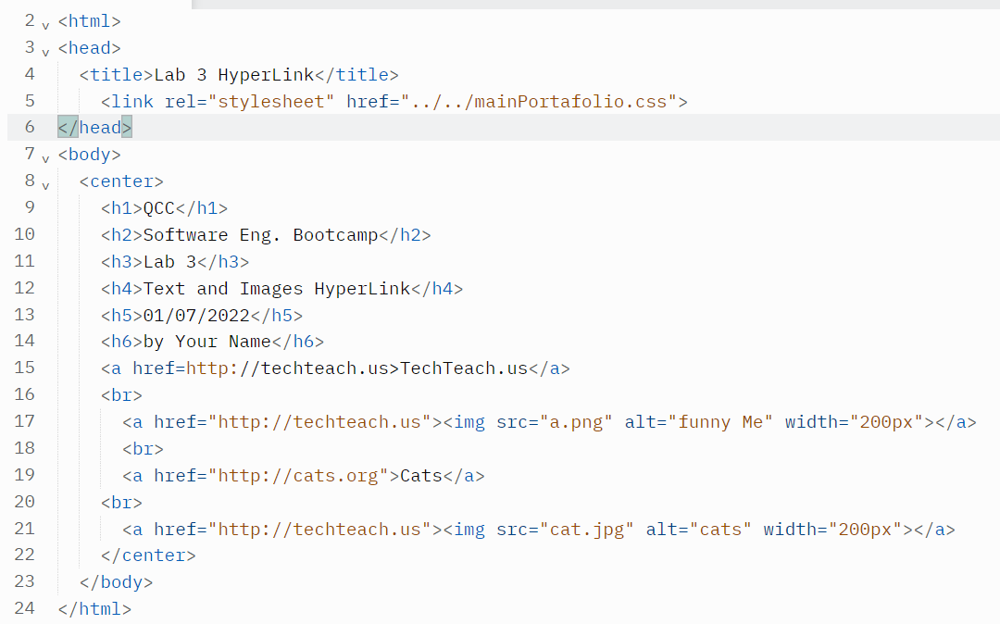
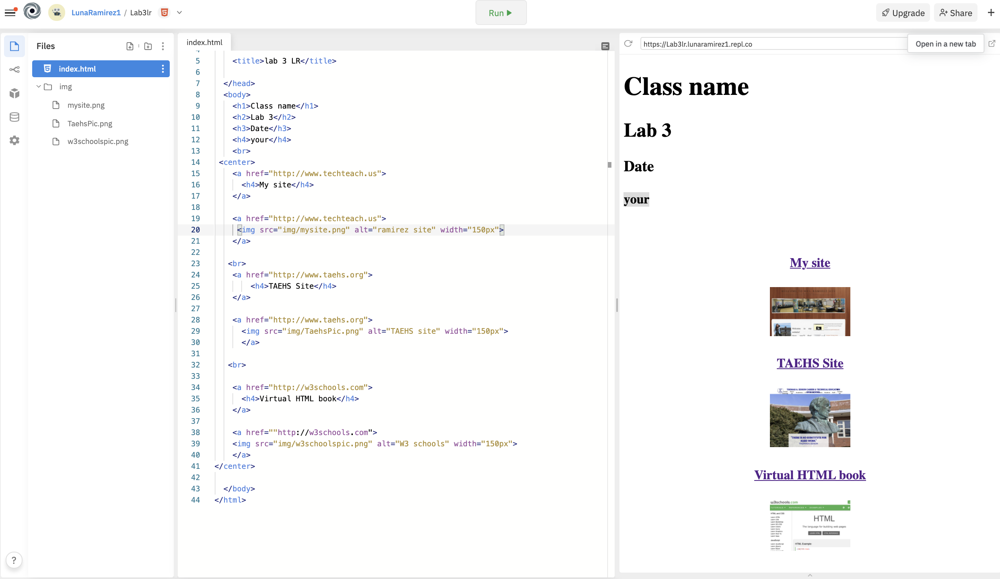

# Instructions  
 Enter URL or hyperLink of Lab 2 lab 2 from repl.it 

underneath there is a sample screenshot

In lab 3 we used repl.it to write our HTML code. The requirement of this lab was to learn how to figure out how to add in hyperlinks into our page. This was the time when we had to work independently and discover things on our own by using the website w3shoools. In order to put our knowledge and practice to work we were instructed to take a screenshot of the w3schools website, Mrs.Ramirez website, and TAEHS website. We had to take a screenshot of these websites because we had to include them into our webpage. Not only did we have to insert images into our html but hyperlinks as will. We had to add hyperlinks as a text and add a hyperlink to the images.The important thing when adding hyperlinks into your HTML code is that you must use the tag <a href. If you want to add a hyperlink to one of your images the  tag <a href must be added right before the image you inserted  because this will allow the computer to understand that you want to add a hyperlink to a specific image. If you want to add a hyperlink as a text you would right the tag <a href first and then type in the text. You must remember to close the tag with </a> with using <a href or else the hyperlink will not work.
 

  ## Steps
  1. Insert HTML element
  2. Copy code as shown on the picture.
  3. TEXT Link to QCC
  4. TEXT Link to your LinkedIn
  5. TEXT Link to W3Schools
  6. IMAGE Link to QCC
  4. IMAGELink to your LinkedIn
  5. IMAGE Link to W3Schools

  For example, :

  
    
  
  